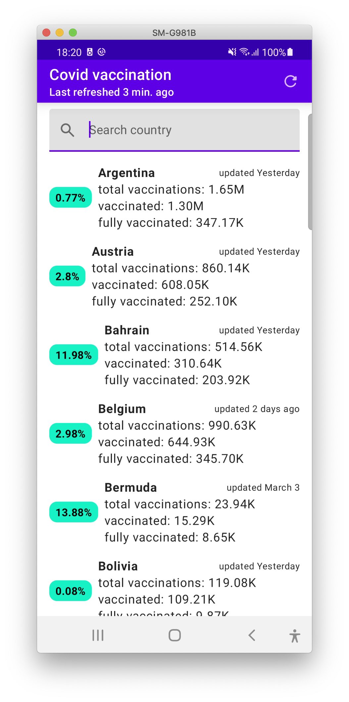
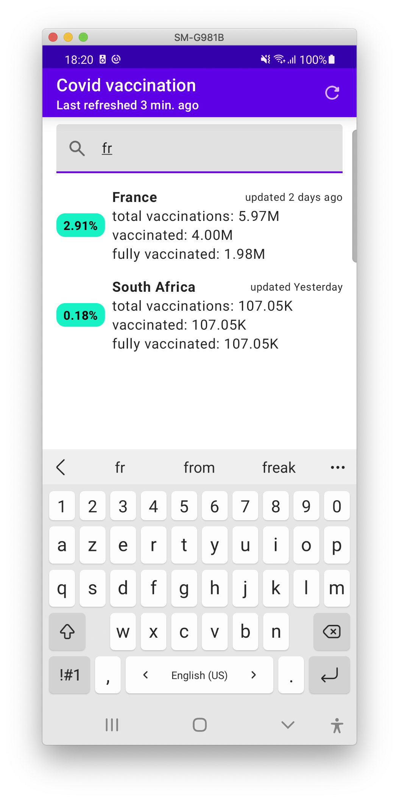

# Covid vaccination app
Sample app using Jetpack Compose + Dagger Hilt in a MVI implementation usgin [the mobius framework](https://github.com/spotify/mobius)

# Screenshots
     

# Data
Taken from https://github.com/owid/covid-19-data more specificaly [this page](https://covid.ourworldindata.org/data/vaccinations/vaccinations.json)

# Pre requisites
Needs to run on [AS canary](https://developer.android.com/studio/preview/) version because of compose doing some funky stuff with AGP which needs to be on version 7 which is only compatible with the JDK11 which is shipped in the latest AS. 
